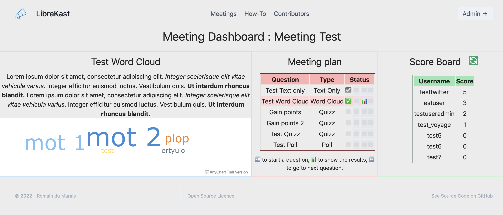

# LibreKast

**A nice and free web app to gamify and animate your meetings, build with django channels and anychart free.**

I am not a developper, so this code is far from perfect ! Although it runs, please bear in mind that the design of LibreKast is driven by what I managed to do, and not really what I planned to do (in terms of design).

[](https://github.com/RduMarais/LibreKast/blob/master/LICENSE)


## Summary

 * [Functionnalities](#Functionnalities)
 * [Roadmap](#project-roadmap)
 * [Code architecture](#code-architecture)
 * [Deploy for development](#how-to-deploy-for-development)
 * [Deploy for production](#how-to-deploy-in-production)
 * [How to get Twitch and Youtube tokens](#get-stream-tokens)
 * [State Diagram](#current-state-diagram)

## Functionnalities

There are 4 types of question you can show in the app : 

 * **Text-only** : displays only text (ideal for start and end of the meeting)
 * **word cloud** : displays a chart with all submitted words
 * **poll** : asks a question. on question close, shows the number of votes each choice got.
 * **Quizz** : asks a question. One of the answers is marked as 'correct', all attendants that chose the correct answer receive 1 point, the first one to answer receives an additionnal point.

Moreover, there are **flags**, that can be submitted by participants to earn points, both in their interface or as QR codes.

The meeting organizer can access a special dashboard with live scoreboard, live results and buttons to navigate between questions.

There are 4 types of meetings : 

 * IRL meetings : those are beekast-like meetings. You need to register as explained below to join the meeting.
 * Youtube Live Stream : the chat is automatically fetched by Youtube
 * Twitch live Stream : the chat is fetched with Twitch Helix API (needs API tokens)
 * Double Stream : the chat is aggregated both from Youtube and Twitch. All interactions are made accross both platforms

To connect to a meeting, participants only need to go to Meetings > choose the meetings. A meeting code is needed to register, by default it is `Pour1nf0`.

You can connect in the admin interface with user : `defaultsuperuser` and password `LibreKast`. To pass some questions, just mark them as done in the admin panel. Every request gets the next question by fetching the first question in order that has no already be done.

There are several ways you can add bots in your meetings : 

 * **Periodic bots** : these will regularly send a message in the one you define in the administration interface. The duration between 2 messages is defined in the instance settings.
 * **Message bots** : they will answer a message starting with "!" (or the character you define in the instance settings).
 * **Revolution bots** : They will keep track of the messages calling them (with the default character "!") and once the number of commands sent is more than a threshold, it sends a message, and starts an animation in the dashboard (the animation can be shown over OBS). The animation is a webm video (you may have to setup your proxy to allow certain file sizes). 

#### demo

 * Admin : `defaultsuperuser` : `LibreKast`
 * Join Meeting code : `Pour1nf0`

#### Screenshots



You can find screenshots : 

 * [of quizz correction](screenshots/quizz.png)
 * [of home page](screenshots/home.png)

## Project roadmap

v0.4.1 : 

 * Flag feature
	 * [ ] back : handle prefixes
 * Bots features
 	 * [ ] front : modify message bots in dashboard
 * Documentation : 
 	 * [x] Add documentation on API tokens
 	 * [x] Add documentation on meeting & question status
 * fix various bugs
	 * [x] front : error mode -> show error messages on dashboard
	 * [x] Youtube : setup alert for Youtube creds
	 * [x] Twitch : setup alert for Twitch connexion error
   * [x] Twitch : put TWITCH_NICKNAME in twitch api settings
   * [x] Twitch : fix bug using wrong oauth token
	 * [ ] Twitch : add attendee is subscriber attribute in dashboard
	 * [ ] BUG : reproduce & solve error in transition from YT WC to YT poll in prod throwing an exception
	 * [ ] BUG : reproduce & solve error in transition from IRL WC to keep WC going
 * Prompt feature : 
     * [ ] make another RO consumer & route for prompts and chat log
     * [ ] make another RO consumer & route for admin

 * v0.4.2 : stateful meeting
     * [x] back : current question state
       * i need more work on async states to have the admin changing the state and the users reading it
     * [x] back : joining during a question
     * [x] front : fix error message on connexion
     * [x] back : fix the init phase that is executed only once per meeting
     * [ ] back : go back button in dashboard
     * [ ] front : go back button in dashboard
     * [ ] front : type de question : appréciation /100 (échelle)
 * v0.4.3 : code quality, error handling and refactor
     * [ ] back : init periodic bots for both youtube and twitch (process depends on youtube as of now)
     * [ ] back : bleach word cloud
     * [ ] back : redirection on login
     * [ ] back : refactor QR code creation processes

v0.4.4 : QoL

 * [ ] front : create a dedicated meeting admin interface
 * [ ] front : have a nicer dashboard
 * [ ] front : change admin interface to be modular
 * [ ] back : make docker-compose
 * [ ] back : add env var for redis cache port
 * [ ] Youtube : automatically generate short answer for poll & quizz

v0.4.5 : feature images slides

 * [ ] add Image slides

v0.4.6 : feature vote bayésien

 * [ ] front : question type : vote bayésien = plusieurs appréciation sur 5

v0.5.0 : installation and Quality of Life

 * [x] install script
 * [ ] front : dashboard colors 
 * [ ] Youtube : setup oauth redirection for API
 * [ ] refactor : make question object-oriented in consumers
 * [ ] refactor : code wrapping and documentation
 * [ ] back : join during a question
 * [ ] refactor : use proper logging
 * [ ] docker wrapping
 * [ ] readthedocs
 * [ ] documentation on Google & Twitch API
 * [ ] documentation on OBS integration
 * [ ] dulicate question and meetings
 * [ ] make twitch and youtube an interface and have bot logic in a separate file

## code architecture

The code is a django project named 'pollsite', made with 2 apps : 

 * `home` : hosts all the appearance of the home page as models.
 * `polls` : hosts all the core functionalities of the app.
 * `static`
 * `templates`

In `polls` app, the different URLs are handled in the `views.py` file. All websockets communications are handled (synchronously) in the `consumers.py` file.
The difference between question types is handled using a `question_type` attribute, which can be `TO`, `QZ`, `QZ` or `WC`.

For the meeting types, I went with optional fields instead of a complex heritage model, in order to get quickly something working. Yes it's lame, but hey - it works.


## How to deploy for development

__pre-requisites : python(3.8 or above) and pip must be installed__ 


**0. create and activate a virtual environment inside a new directory**

It is highly recommended to use virtual environments when yout set up a new project. If you are new to virtual environments read [python-3 official docs](https://docs.python.org/3/library/venv.html) 

**1. clone this repo `django-polling-site` in your directory**

```bash
git clone https://github.com/RduMarais/LibreKast.git
```

**2. install the requirements**

The requirements listed are the versions I used to test & develop the app. Feel free to tamper with the versions, just keep in mind that different package versions have not been tested !

```bash
# debian/Ubuntu etc
sudo apt-get install libmagic1
# MacOs : 
brew install libmagic

# install python packages 
pip install -r requirements.txt
```

**3. move inside the `pollsite` directory and make migrationS**

```bash
python manage.py makemigrations home
python manage.py makemigrations poll
python manage.py migrate
```

**4. Security settings**

create a superuser , with your own username and password

```bash
python manage.py createsuperuser
```
A default superuser exists, named `defaultsuperuser` with password `LibreKast`.

Then create a secure secret key:

```bash
python -c 'from django.core.management.utils import get_random_secret_key; \
            print(get_random_secret_key())'
export SECRET_KEY="<your secret key>"
```

**5. Collect Static files needed**

```bash
python manage.py collectstatic
```

**6. Run Redis in a docker container**

check [here](https://www.docker.com/get-started) if you need to install docker.

```bash
docker run -p 6379:6379 -d redis:5
```

**7. Setup env variables**


```bash
export ALLOWED_HOSTS_LOCAL="<the url you plan to serve the app to>"
export DJANGO_SETTINGS_MODULE="pollsite.settings"

# only if this is for debugging
export DEBUG=True
# is your server does not have a valid certificate (some browser will throw errors if this is not enforced)
# this removes secure web socket and secure cookies
export DISABLE_ENCRYPTION=True 
```

**8. now run the server**

```bash
python manage.py runserver
```

> Note that this step runs an ASGI server. If you are used to deploy WSGI server, this involves a few differences !! Especially when dealing with sockets, be sure to install `uvicorn[standard]` and not `uvicorn` to deal with these.

Go to http://127.0.0.1:8000/. This is where Django starts server by default

**Enjoy**

Click on Admin button on top right corner to go the the Django Administration page.
You can add meetings, change or add questions and choices etc.


## How to deploy in production

In order to setup LibreKast in an deployment envionment, one needs to :

 1. setup a web server (such as Apache or Nginx), 
 2. setup an ASGI server for delivering a django app 
   * *please note that you have to redirect not only HTTP, but also websockets !*
 3. clone the repository to start the app. 
 4. _By defaults, all environments variables are setup for prod_, but you should setup some more variables :  : 
	 * `SECRET_KEY` : generate a secure key with the following code : 
		```bash
		 python -c 'from django.core.management.utils import get_random_secret_key; \
            print(get_random_secret_key())'
		 export SECRET_KEY="<your secret key>"
		```
	 * `ALLOWED_HOSTS_LOCAL` : add your server IP/hostname. I recommend setting up a dedicated subdomain (such as _librekast.domainname.com_)
	 * `TWITCH_CLIENT_ID` : generate a client ID for the account you are using to fetch the chat. this can be done [in the Twitch console](https://dev.twitch.tv/console)
	 * `TWITCH_CLIENT_SECRET` : this too should be done [in the Twitch console](https://dev.twitch.tv/console)
	 * `TWITCH_OAUTH_TOKEN` : this should be requested on [Twitch Chat OAuth Password Generator](https://twitchapps.com/tmi/) and grants authorization to use the account for LibreKast.
	 * `NGINX_PROXY` : it's a good practice to have an nginx reverse proxy adding `X-Forwarded-Proto` headers. if you do, it's better to setup this var to `True`
	 * `DJANGO_SETTINGS_MODULE=pollsite.settings` because why not
	 * add your server IP/hostname to the `ALLOWED_HOSTS` 
 5. create a superuser and remove the default user (or change its password)
 6. collect static files and migrate them in the server static folder
 	 * it is a good practice to serve **static files** and **media files** separately using your end server (such as nginx reverse proxy)
 7. start the ASGI server
	 * you may need to export `DJANGO_SETTINGS_MODULE` or other env variables in the command running the server

With Gunicorn/uvicorn, the last step is the following : 

```bash
export DJANGO_SETTINGS_MODULE=pollsite.settings
gunicorn pollsite.asgi -b 127.0.0.1:8010 -w 2 -k uvicorn.workers.UvicornWorker --chdir ./pollsite/ -e DJANGO_SETTINGS_MODULE=pollsite.settings --log-file librekast.log
```

> lmk if you need my redirection setup for nginx or a docker image

## Get Stream Tokens

#### Twitch

 * get an IRC chat token at https://twitchapps.com/tmi (token should have the form oauth:XXXXXX)
 	 * OAuth token in django admin dashboard (without the "oauth:" part)
 	 * this is responsible for connecting to twitch chat in an app
 * create an app at https://dev.twitch.tv/console and create a new client secret
 	 * App Client ID in django admin dashboard
 	 * Client secret in django admin dashboard
 	 * these tokens are responsible for allowing LibreKast to interact with your Twitch account as an app

#### Youtube

 * Go to https://console.cloud.google.com/apis/credentials
     * create an API key
     * create an App for your instance
     * create a workstation client ID at https://console.cloud.google.com/apis/credentials/oauthclient/
     * get these client ID and client secret and paste them in the app

## Current State diagram 

#### Meeting states

The meeting has an attribute `_is_running` that is set to True when the first admin to connect connects to the dashboard. Then the connexion of the admin has an attribute (`is_Admin`) to follow which one of the staff connected is the one actually managing the meeting. The others are read-only.

 * If the client is disconnected, both of these attribute are reset so you need to refresh the page to get control back.
 * If the server is disconnected, an init script resets all meeting to not running

During the meeting, there is a state to follow what is happening. This enables users to join during a question : 

 * `WAITING` ='W' : the meeting has started and is waiting for the next question to start
 * `ONGOING` ='O' : there is a question ongoing
 * `RESULTS` ='R' : the question is over, the results of this question are displayed
 * `SCOREBOARD` ='S' : the scoreboard is displayed
 * `AFTER` ='A' : the meeting is over
 * `BEFORE` ='B' : the meeting has not started yet
 * `UNDEFINED` ='U' : something went wrong ?

#### Flow

based on current implem (not the final goal)

```
CLIENT                                      SERVER                          GROUP
  |                                           |                               |
  |          --> question-start -->           |                               |
  |                                    get current question                   |
  |                                           |                               |
  |          <-- question-ready <--           |                               |
showWait                                      |                               |
  |                                           or                              |
  |             <-- question-go <--           |                               |
 if Poll/Quizz :                              |                               |
 showQuestion                                 |                               |
  |                                           |                               |
  |          --> vote -->                     |                               |
  |                <-- voted <--              |                               |
  |                                         if Poll :                         |
  |                <-- results <--            |   --> notify-update-poll -->  |
showResultsPoll                               |                           updatePoll
  |                                           |                               |
  |                                        end : results                      |   
  |                <-- results <--            |    --> results -->            |
  |                                           |                               |
  |                                     end : close                           | 
  |                                           |    --> question-close -->     | 
  |                                           |                               |
 if Word Cloud :                              |                               |
 showWordCloud                                |                               |
  |          --> word-cloud-add -->           |                               |
  |                                        add vote                           |
  |                                           |   --> notify-update-cloud-->  |
  |                                           |                          updateWordCloud
  |                                           |                               |
  |                                        end : close                        |   
  |                                           |    --> question-close -->     | 
  |                                           |                             showWait
  |                                           |                               |
  |                                           if                              |
  |                                           |    --> next-question -->      | 
  |                                           |                             showWait
  |                                           |                               |
  |                                           |                               |
 wait for score                               |                               |
  |            --> get-score  -->             |                               |
  |           <-- update-score <--            |                               |
updateScore                                   |                               |
  |                                           |                               |
```
